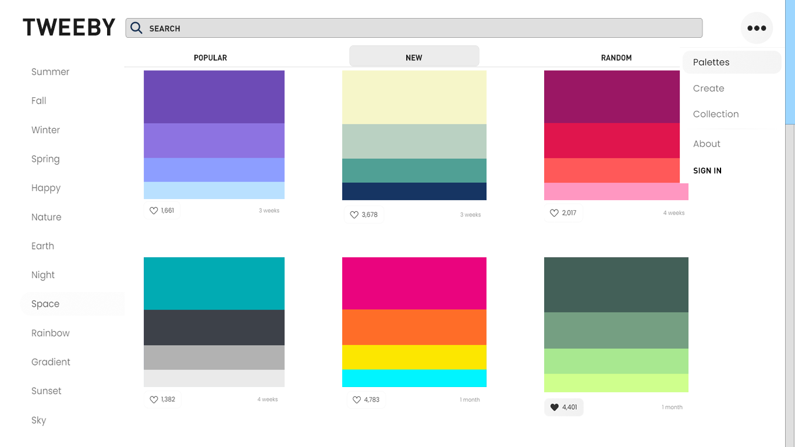
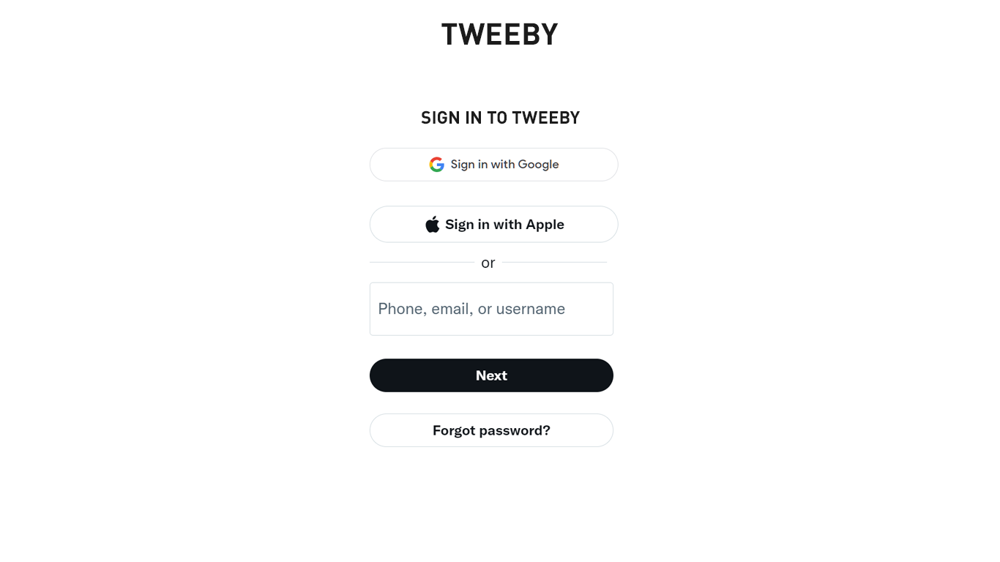
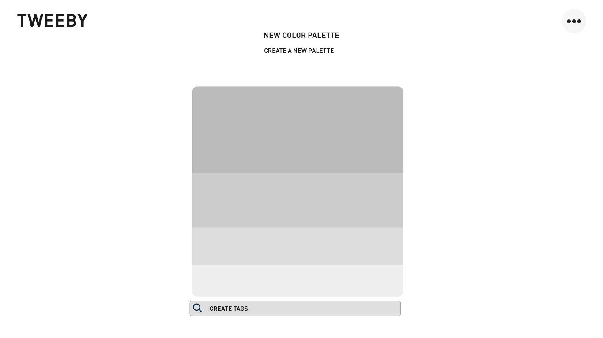

# Требования к проекту

---

[//]: # (TODO: ReWrite to SRS)
## Содержание

[1 Введение](#1-введение)  
[1.1 Назначение](#11-назначение)  
[1.2 Бизнес-требования](#12-бизнес-требования)  
[1.2.1 Исходные данные](#121-исходные-данные)  
[1.2.2 Возможности бизнеса](#122-возможности-бизнеса)  
[1.2.3 Границы проекта](#123-границы-проекта)  
[1.3 Аналоги](#13-аналоги)  
[2 Требования пользователя](#2-требования-пользователя)  
[2.1 Программные интерфейсы](#21-программные-интерфейсы)  
[2.2 Интерфейс пользователя](#22-интерфейс-пользователя)  
[2.3 Характеристики пользователей](#23-характеристики-пользователей)  
[2.3.1 Классы пользователей](#231-классы-пользователей)  
[2.3.2 Аудитория приложения](#232-аудитория-приложения)  
[2.3.2.1 Целевая аудитория](#2321-целевая-аудитория)  
[2.3.2.1 Побочная аудитория](#2322-побочная-аудитория)  
[2.4 Предположения и зависимости](#24-предположения-и-зависимости)  
[3 Системные требования](#3-системные-требования)  
[3.1 Функциональные требования](#31-функциональные-требования)  
[3.1.1 Основные функции](#311-основные-функции)  
[3.1.1.1 Вход пользователя в приложение](#3111-вход-пользователя-в-приложение)  
[3.1.1.2 Наличие уведомлений](#3112-наличие-уведомлений)  
[3.1.1.3 Выход зарегистрированного пользователя из учётной записи](#3113-выход-зарегистрированного-пользователя-из-учётной-записи)  
[3.1.2 Ограничения и исключения](#312-ограничения-и-исключения)  
[3.2 Нефункциональные требования](#32-нефункциональные-требования)  
[3.2.1 Атрибуты качества](#321-атрибуты-качества)  
[3.2.1.1 Требования к удобству использования](#3211-требования-к-удобству-использования)  
[3.2.1.2 Требования к безопасности](#3212-требования-к-безопасности)  
[3.2.2 Внешние интерфейсы](#322-внешние-интерфейсы)  

# 1 Введение

## 1.1 Назначение

В этом документе будут описаны функциональные и нефункциональные требования к
десктопному приложению "Tweeby". Данный документ предназначен для
команды, которая будет реализовывать приложение.

## 1.2 Бизнес-требования

### 1.2.1 Исходные данные
Для людей, занимающихся дизайном приложений, фронтенд-разработкой и прочим, зачастую нужна цветовая палитра. Существуют аналоги данного приложения, но они зачастую имеют устаревший интерфейс либо имеют слишком перегруженные интерфейс. Более того,  за счёт большой базы данных всевозможных цветов и их сочетаний, сервис предоставляет огромный выбор, где каждый сможет найти для себя полностью подходящий вариант. Более того, в приложении будет представлена возможность сохранения определенных цветовых палитр, что также упросит пользование приложением, ведь когда вы создадите или найдите нужную вам палитру, вы сможете сохранить и использовать её в будущем.

### 1.2.2 Возможности бизнеса
Данное приложение с удобно сконструированным интерфейсом позволяет с первых секунд найти необходимую подборку цветов, что повысит приток пользователей на сайте. В последствии с расширением интерфейса и добавлением новых подборок, приток новых пользователей должен вырасти.

### 1.2.3 Границы проекта

Приложение «Tweeby» не требует обязательной регистрации, что позволит пользователям без лишних проблем зайти на сайт и найти необходимую подборку цветов. При желании сохранить их в собственную подборку, они могут пройти этап регистрации, который не занимает много времени.

## 1.3 Аналоги
Adobe Color CC – сайт для конструирования цветовой палитры с удобным интерфейсом, но лишенный уже готовых вариантов, как это представлено в «Tweeby».
Coolors – сайт, генерирующий палитры по клику мыши до тех пор, пока не выпадет цвет, понравившийся пользователю. Интерфейс не самый удобный для выбора цветовой палитры для будущего дизайна.
ColorSpace – сайт, базирующийся на подборе цветовых схем на основе уже определенного цвета. Интересное решение, но не совсем удобное для выбора интересных цветовых решений для дизайнов приложений.
# 2 Требования пользователя

## 2.1 Программные интерфейсы

Цветовые схемы базируются на уже существующих и на новых решениях, добавленных новыми пользователями.

## 2.2 Интерфейс пользователя

Главный экран сайта.  
 
Окно регистрации нового пользователя.  
  
Создание собственной цветовой палитры

## 2.3 Характеристики пользователей

### 2.3.1 Классы пользователей

| Класс пользователей             | Описание                                                                                                                        |
|:--------------------------------|:--------------------------------------------------------------------------------------------------------------------------------|
| Анонимные пользователи          | Пользователи, которые не хотят регистрироваться в приложении. Имеют доступ к частичному функционалу.                            |
| Зарегистрированные пользователи | Пользователи, которые вошли в приложение под своим именем. Имеют доступ к полному функционалу. Могут добавлять палитры в собственную коллекцию |

### 2.3.2 Аудитория приложения

#### 2.3.2.1 Целевая аудитория

Люди любой возрастной категории интересующиеся интересными цветовыми решениями для их работы.

#### 2.3.2.2 Побочная аудитория
Люди любой возрастной категории, желающие посмотреть или создать разные цветовые палитры.

## 2.4 Предположения и зависимости

1. Приложение не работает при отсутствии подключения к Интернету;

# 3 Системные требования

## 3.1 Функциональные требования

### 3.1.1 Основные функции

#### 3.1.1.1 Вход пользователя в приложение

Пользователь имеет возможность использовать приложение без
создания собственного аккаунта либо войдя в свою учётную запись.

| Функция                                                               | Требования                                                                                                                                            | 
|:----------------------------------------------------------------------|:------------------------------------------------------------------------------------------------------------------------------------------------------|
| Вход в приложение без создания собственного профиля.                  | Приложение предоставляет возможность пользоваться им без авторизации                                                                                  |
| Регистрация нового пользователя.                                      | Приложение должно запросить у пользователя ввести данные для создания учётной записи. Пользователь должен либо ввести данные, либо отменить действие. |
| *Пользователь с таким именем существует.*                             | *Приложение должно известить пользователя об ошибке регистрации и запросить ввод. Пользователь должен либо ввести псевдоним, либо отменить действие.* |
| Вход зарегистрированного пользователя в приложение.                   | Приложение направляет пользователя на главную страницу с расширенным функционалом и возможностью сохранять палитры в собственную коллекцию                                                                                  |

#### 3.1.1.2 Наличие уведомлений
Уведомления в данном приложении не используются.
#### 3.1.1.3 Выход зарегистрированного пользователя из учётной записи

Зарегистрированный пользователь имеет возможность выйти из учётной
записи.

Приложение должно предоставить зарегистрированному пользователю
возможность выйти из учётной записи с возвратом к окну входа в приложение.

### 3.1.2 Ограничения и исключения

1. Приложение функционирует в полном наборе возможностей только при наличии
   подключения к Интернету;
## 3.2 Нефункциональные требования

### 3.2.1 Атрибуты качества

#### 3.2.1.1 Требования к удобству использования

1. Доступ к основным функциям приложения не более чем за две операции;
2. Функциональные элементы не перегружают экран;

#### 3.2.1.2 Требования к безопасности

1. Приложение предоставляет возможность просмотра и редактирования
профиля только зарегистрированного пользователя.

### 3.2.2 Внешние интерфейсы

Окна приложения удобны для использования продолжительное время:

